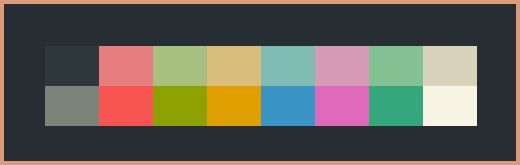
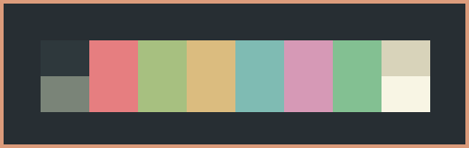
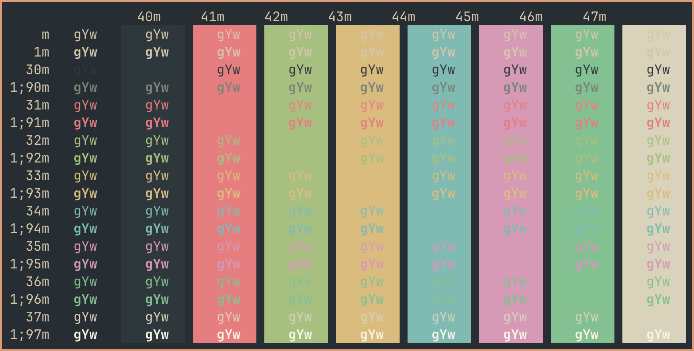

# Everforest Ghostty
My own custom made Everforest color schemes for Ghostty.

 

* [Ghostty for macOS and Linux](https://ghostty.org/)

* [Everforest color scheme](https://github.com/sainnhe/everforest)

* [Everforest website](https://everforest.vercel.app/)

* [Everforest for Starship](https://github.com/martelo11/starship-everforest-themes) 

Place files in ~/.config/ghostty/themes/ (create folders if non-existing).

*Everforest*

 

 

*Everforest 2 (without alternative colors for bold text)*

 

